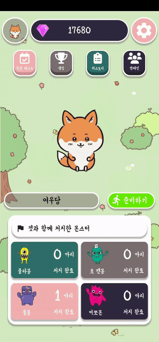
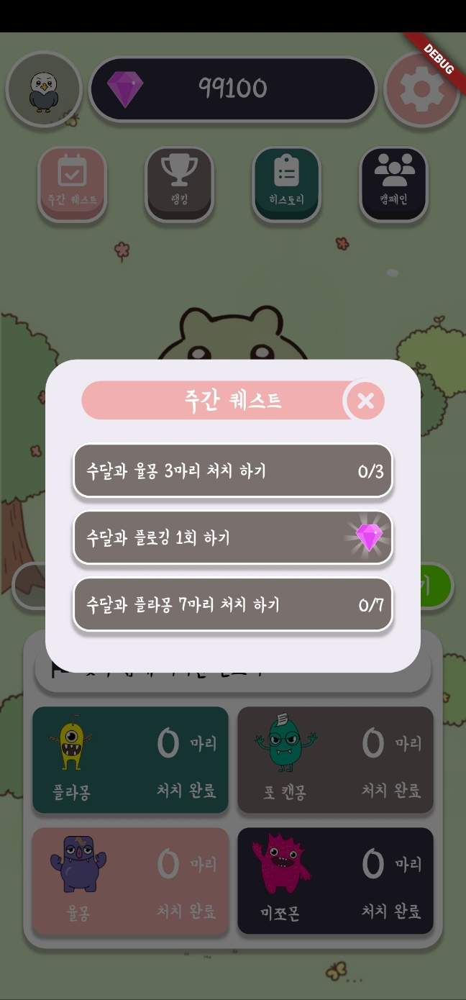
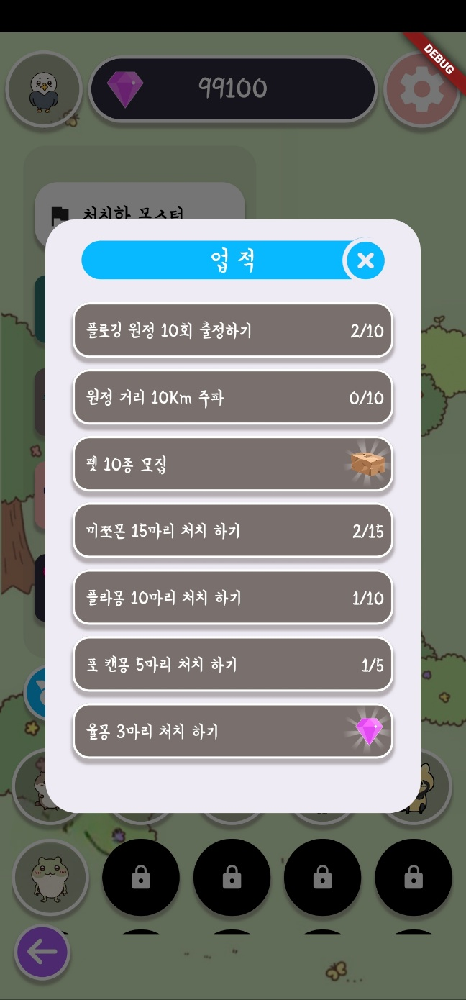
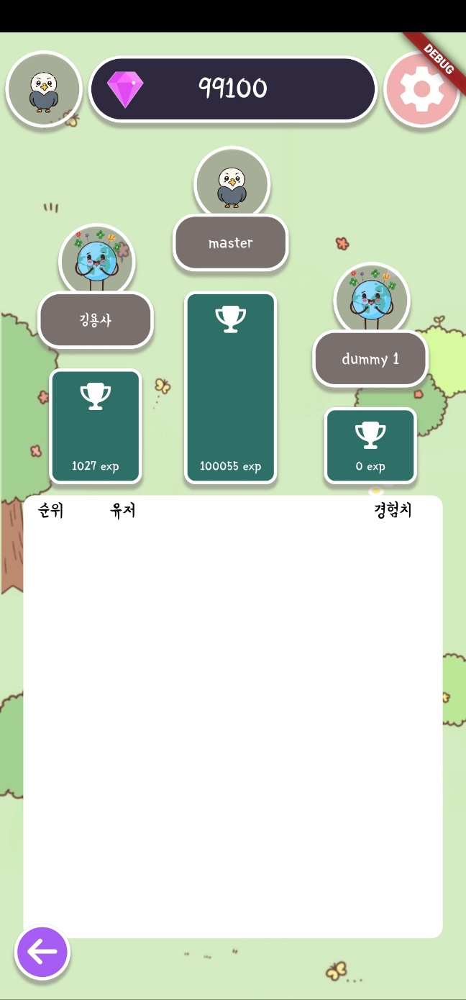
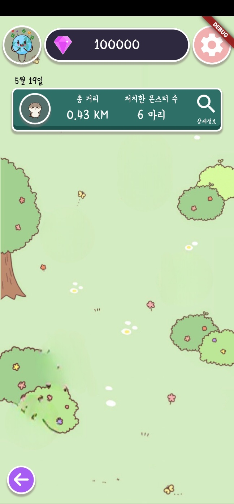
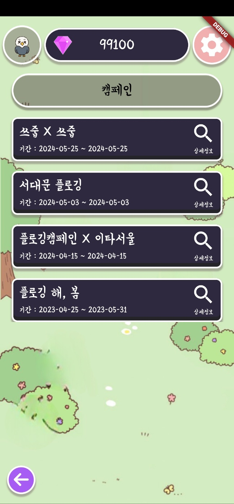

<center>
    
    <br>
    <span style="font-size:200%">더러워진 지구를 구하기 위한 플로깅 용사들의 모험</span>  
</center>

<br>
<br>

# 목차

- [팀원 소개](#팀원-소개)<br>
- [개요](#개요)<br>
- [주요 기능](#주요-기능)<br>
- [서비스 화면](#서비스-화면)<br>
- [주요 기술](#주요-기술)<br>
- [프로젝트 파일 구조](#프로젝트-파일-구조)<br>
- [프로젝트 산출물](#프로젝트-산출물)<br>

<br>
<br>

# 참여 인원

|                          전규훈                          |                        김민욱                        |                            강성권                             |                          김혁일                          |                           최시원                           |                        박미성                        |
| :------------------------------------------------------: | :--------------------------------------------------: | :-----------------------------------------------------------: | :------------------------------------------------------: | :--------------------------------------------------------: | :--------------------------------------------------: |
|                      Iot (Leader)                      |                        Front                         |                             Front                             |                       Back, Server                       |                            Back,Server                            |                         AI                         |

<br>
<br>

# 개요

    - 환경에 대한 관심이 높아지면서 그와 더불어 플로깅에 대한 관심도 지속적으로 증가하고 있다.
    - 하지만 현재 플로깅은 환경의 날과 같은 특별한 날에만 실시하는 일종의 행사 같은 느낌이 있다.
    - 이러한 단발적인 플로깅 행사들을 넘어 사람들의 지속적인 플로깅 참여를 독려하기 위한 어플리케이션

<br>
<br>

# 주요 기능

### 플로깅을 진행하면서 집게에 장착한 Iot 기기를 통한 쓰레기 종류 판별

    - 어플리케이션과 집게에 장착한 Iot 기기와 블루투스 연결
    - 플로깅을 진행하면서 Iot 기기로 주운 쓰레기 사진을 찍고 AI로 쓰레기 종류 판별

### 플로깅 진행 후 쓰레기 종류 판별을 기반으로 한 펫 키우기 시스템

    - 20여 종의 멸종위기 동물 캐릭터(펫) 키우기 기능
    - 판별한 쓰레기 종류에 따라 펫에게 경험치 혹은 유저에게 재화 제공
    - 주간 퀘스트, 업적을 통한 펫, 재화 획득 기능
    - 획득한 재화를 기반으로 한 펫 뽑기 기능
    - 펫을 키우며 획득한 경험치를 기반으로 한 유저별 랭킹정보 조회 기능
    - 플로깅을 진행했던 날짜별 히스토리 정보 제공

### 내 주변 쓰레기통 위치 정보, 지역별 쓰레기 현황 정보 제공

    - 현재 위치 기준 주변 쓰레기통 데이터에 따라 쓰레기통 위치 정보 제공(현재는 광주 광산구 한정)
    - 유저가 플로깅하면서 주웠던 쓰레기 정보를 저장하고, 그 정보에 따른 지역별 쓰레기 현황 제공

### 전국 단위의 플로깅 정보 제공

    - 기존의 단발적이고 지역 한정적인 플로깅 행사 정보를 한 데 모아 볼 수 있는 기능
    - 혼자하는 플로깅을 넘어 함께 참여할 수 있는 플로깅 참여 독려

<br>
<br>

# 서비스 화면

## 메인화면

|  |  |
| :-----------------------------------------------: | :-----------------------------------------------: | 
|               인트로               |               서비스 메인 화면               |

## 주간 퀘스트, 업적

|  |  |
| :----------------------------------------------: | :----------------------------------------------: |
|                    주간 퀘스트                     |                    업적                     |

## 랭킹

|  |
| :----------------------------------------------------: | 
|                  랭킹                   |

## 히스토리

|  |
| :----------------------------------------------------: |
|                  히스토리                   |

## 캠페인

|  |
| :----------------------------------------------------: | 
|                  캠페인                   |

## 펫

|  |  |  |
| :----------------------------------------------------: | :------------------------------------------------: |
:------------------------------------------------: |
|                  플로깅 준비                   |                       플로깅 진행                       |                       플로깅 진행                       |

## 플로깅

|  |  |
| :----------------------------------------------------: | :------------------------------------------------: |
|                  플로깅 준비                   |                       플로깅 진행                       |

<br>
<br>

# 주요 기술

**Backend**
<br>

&nbsp;&nbsp;&nbsp;&nbsp;&nbsp;&nbsp;

- Java : 17
- Spring Boot : 3.2.2
- Spring Data JPA : 3.2.2
- Spring Security : 3.2.2
- JWT
- QueryDSL
- IntelliJ : 2023.3.2
- Gradle : 8.5
- MySQL : 8.0.35
- Redis : 3.0.504

<br>

**3D**
<br>

&nbsp;&nbsp;&nbsp;

- Python : 3.11.7
- Flask : 3.0.2
- Blender : 2.8.1
  - MB-Lab : 1.7.8.9

<br>

**FrontEnd**
<br>

&nbsp;&nbsp;&nbsp;&nbsp;&nbsp;&nbsp;&nbsp;&nbsp;

- React 18.2.0
- Vite 5.0.8
- Vite Pwa 0.17.4
- Npm 10.2.5
- Node.js 20.10.0
- Axios 1.6.7
- React-Three/fiber 8.15.16
- Hls.js 1.5.3
- Videosdk 0.1.83
- Recoil 0.7.7
- Recoil-persist 5.1.0
- Tailwindcss 3.4.1
- Aws-sdk/client-s3 3.511.0
- Chart.js 4.4.1
- Heroicons 2.1.1

<br>

**CI/CD**
<br>

&nbsp;&nbsp;&nbsp;&nbsp;&nbsp;&nbsp;&nbsp;

- Docker : 25.0.2
- Jenkins : 2.441
- Nginx : 1.18(Ubuntu)
- AWS
  - EC2
  - RDS
  - S3

<br>

**협업 툴**
<br>

&nbsp;&nbsp;&nbsp;&nbsp;&nbsp;

- 형상 관리 : Git
- 이슈 관리 : Jira
- 커뮤니케이션 : Mattermost, Webex, Notion, Discord
- 디자인 : Figma

<br>
<br>

# 프로젝트 파일 구조

#### Backend

```
backend/src
|-- 📂main
|   |-- 📂java
|   |   └-- 📂com.ssafy.backend
|   |       |-- 📂domain
|   |       |   |-- 📂challenge
|   |       |   |-- 📂comment
|   |       |   |-- 📂food
|   |       |   |-- 📂inbody
|   |       |   |-- 📂post
|   |       |   |-- 📂routine
|   |       |   |-- 📂training
|   |       |   └-- 📂user
|   |       └-- 📂global
|   |           └-- 📂config
|   |           └-- 📂dto
|   |           └-- 📂entity
|   |           └-- 📂error
|   |           └-- 📂jwt
|   └-- 📂resources
|       └-- application.yml
└-- 📂test
```

#### Frontend

```
frontend
|-- 📂dist
└-- 📂public
|   |-- 📂3D
|   |-- 📂challenge
|   |-- 📂common
|   |-- 📂diary
|   └-- 📂loading
└-- 📂src
    |-- 📂assets
    |-- 📂components
    |   |-- 📂challenge
    |   |-- 📂common
    |   |-- 📂diary
    |   |   |-- 📂food
    |   |   |-- 📂graph
    |   |   └-- 📂training
    |   |       |-- 📂history
    |   |       └-- 📂routine
    |   |-- 📂modal
    |   |-- 📂mypage
    |   └-- 📂threedmodel
    |-- 📂pages
    |   |-- 📂auth
    |   |-- 📂challenge
    |   |   └-- 📂WebRTC
    |   |-- 📂diary
    |   |   |-- 📂food
    |   |   └-- 📂training
    |   |-- 📂home
    |   └-- 📂mypage
    |-- 📂recoil
    |   |-- 📂common
    |   |-- 📂diary
    |   └-- 📂modal
    └-- 📂router

```

<br>
<br>

# 프로젝트 산출물

- [요구사항 명세서](https://antique-scale-1a2.notion.site/69cc5f7b94b340439022beaa36675c77)
- [API 명세서](https://antique-scale-1a2.notion.site/API-54c31f40c2224a118bcf1c3dbd18ce92)
- [ERD](https://www.erdcloud.com/d/t3xtRMofbn7Nrthyk)
- [와이어프레임(피그마)](https://www.figma.com/file/XFbm01vx7fkKHHvAjCvsPl/%EC%93%B0%EB%A6%AC%EB%94%94%EB%B0%94%EB%94%94?type=design&node-id=4-2&mode=design&t=O5FMFzr8gp3KKMSj-0)
- [시스템 아키텍처](https://app.cloudcraft.co/view/1c5c2ff3-67b0-40ab-a3c0-775678b09305?key=f15dfd05-a929-455d-9e33-59becb6a5f29)
